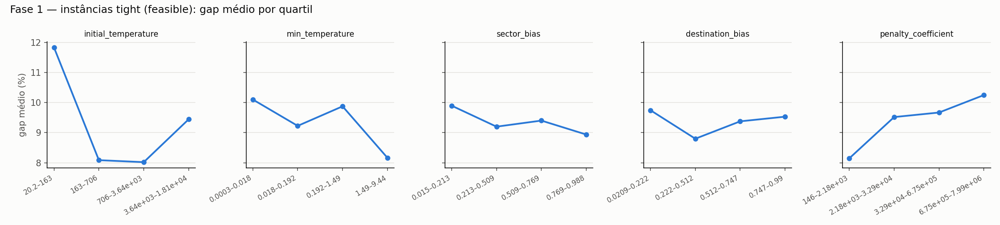
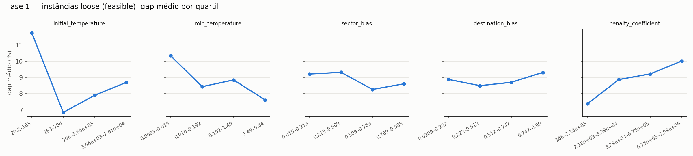
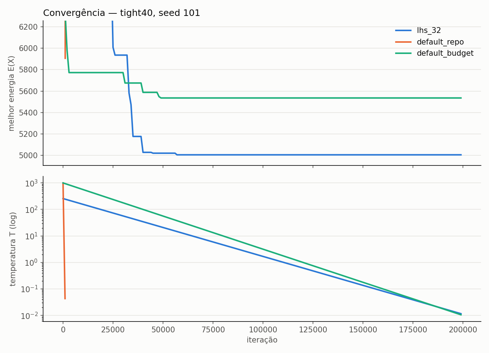

# Relatório — calibração do Simulated Annealing contra o MIP (HiGHS)

**Data:** 2026-09-28 · **Branch:** `fine-tuning` · **Config:**
`configs/experiments/sa_calibration/full.yaml` · **Execuções do SA:** 1.534 (200 mil
iterações cada) · **Código:** `src/calibration/`, `experiments/sa_calibration/run.py`

## Resumo

- **Recomendação:** `lhs_32` — T0 ≈ 257, T_min ≈ 0,011, α derivado do orçamento
  (0,99995 para 200 mil iterações), β ≈ 0,77, γ ≈ 0,25, ρ ≈ 146.
- **Gap médio na revalidação** (8 seeds novas × 3 instâncias, incluindo uma nunca vista):
  **1,96%** (P90 4,6%, 24/24 execuções viáveis), contra **23,8%** do default do
  repositório e **8,1%** do default com α ajustado ao orçamento.
- **O que mais pesou**, nesta ordem:
  1. Gastar o orçamento: o default para em 1.146 iterações. Só derivar α do orçamento
     leva o gap de 23,8% para 8,1%.
  2. ρ baixo: com ρ ≥ 2.000 o SA nunca aceita violar capacidade ou churn. ρ ≈ 146
     permite atravessar regiões inviáveis e leva o gap de 8,9% para 2,1%.
  3. T0 na faixa 160–3.600.
- **β e γ têm efeito pequeno** (≈ 1 p.p. entre quartis, dentro do ruído), inclusive na
  instância apertada.
- **Atenção:** o ganho de ρ vive numa janela estreita. Com ρ < ~100 o SA termina
  inviável, e com ρ = 500 o gap já sobe para ~7,5%. Esse é o ponto frágil da
  recomendação (ver Limitações).
- **Orçamento em excesso:** em todas as execuções de `lhs_32`, a melhor solução para de
  melhorar até a iteração ~76 mil (mediana ~52–57 mil, com T ≈ 15–19). As ~140 mil
  iterações seguintes não acrescentam nada.

## 1. Referência: o MIP fechou em todas as instâncias

`appsi_highs`, `mip_rel_gap = 0.01`. O gap de toda execução do SA é medido contra o ótimo
provado (dentro de 1%), e não contra o limite inferior.

| instância | setores | `capacity_multiplier` | status | ótimo (UB) | LB | gap residual | tempo |
|---|---|---|---|---|---|---|---|
| base40 | 40 | 1.0 | optimal | 4.872 | 4.824 | 0,97% | 1,1 s |
| tight40 | 40 | 0.0027 | optimal | 4.970 | 4.921 | 0,99% | 0,9 s |
| base80 | 80 | 1.0 | optimal | 9.863 | 9.784 | 0,80% | 4,5 s |
| tight80 | 80 | 0.0072 | optimal | 9.863 | 9.784 | 0,80% | 5,3 s |

Nesses tamanhos, o HiGHS resolve o MIP **mais rápido que uma execução do SA** (1–5 s
contra 19–32 s). O SA só se justifica numa escala em que o MIP não feche, e isso ainda
precisa ser medido (ver Próximos passos).

## 2. Protocolo

Está em [`README.md`](README.md): três fases (LHS, TPE, revalidação), parada por
estagnação desligada, 200 mil iterações e α derivado de (T0, T_min). Duas extensões:
varredura de T_min e as configurações do relatório anterior. Depois da revalidação
acrescentei um teste de robustez de ρ (`rec_rho_*`), porque a recomendada ficou perto da
borda de viabilidade.

## 3. Resultados

### 3.1 Revalidação (fase 3: seeds 101–108, `tight80` nunca vista antes)

| config | gap médio | desvio | P90 | viáveis | iterações | s/execução |
|---|---|---|---|---|---|---|
| **lhs_32** | **1,96** | 2,11 | 4,59 | 100% | 200.000 | 24,7 |
| lhs_51 | 5,84 | 2,46 | 8,85 | 100% | 200.000 | 24,5 |
| lhs_18 | 8,12 | 19,67 | 6,92 | 96% | 200.000 | 24,1 |
| tpe_b2_00 | 7,80 | 2,98 | 10,84 | 100% | 200.000 | 23,1 |
| default_budget | 8,12 | 2,91 | 11,34 | 100% | 200.000 | 23,2 |
| default_repo | 23,79 | 3,51 | 28,12 | 100% | 1.146 | 0,13 |

Gap médio por instância:

| config | base40 | tight40 | tight80 (nunca vista) |
|---|---|---|---|
| **lhs_32** | **0,91** | **2,57** | **2,39** |
| lhs_51 | 4,58 | 5,19 | 7,74 |
| lhs_18 | 3,34 | 15,67 | 5,35 |
| tpe_b2_00 | 5,69 | 7,86 | 9,86 |
| default_budget | 6,39 | 8,82 | 9,14 |
| default_repo | 24,82 | 20,35 | 26,19 |

Separado por grupo, a ordem não muda. Nas folgadas, `lhs_32` fica em 0,91 ± 0,91; nas
apertadas, em 2,48 ± 2,36, contra 8,98 do `default_budget`. `lhs_18` fica em 3º pela
regra de decisão mesmo com uma execução inviável: empata com `tpe_b2_00` e
`default_budget` no gap médio (±0,5 p.p.) e ganha no P90, que não capta aquela única
execução com gap 100.

### 3.2 O que determina a qualidade

**Orçamento.** O default do repositório gasta 1.146 iterações, porque o α de 0,99 leva
T de 1000 a 0,01 muito antes do teto. Com os mesmos parâmetros e α derivado do orçamento
(`default_budget`), o gap cai de 23,8% para 8,1%. As configurações finalistas do
relatório anterior mostram o mesmo efeito: `prev_T0_5000` (α = 0,999, ~15 mil
iterações) dá 16,8%, e a mesma configuração com α derivado (`cal_long`) dá 8,8%.

**ρ — viabilidade** (fase 1, 150 execuções por faixa):

| ρ | 1,1–18 | 18–223 | 223–3.222 | 3.222–43.899 | 43.899–699.389 | 699.389–8.000.000 |
|---|---|---|---|---|---|---|
| execuções viáveis | 0% | 22% | 100% | 100% | 100% | 100% |

**ρ — qualidade**, com os demais parâmetros iguais aos de `lhs_32` (extras, `base40` +
`tight40`, seeds 101–105):

| ρ | 146 (`lhs_32`) | 500 | 2.000 | 1.000.000 |
|---|---|---|---|---|
| gap médio | 2,06 | 7,54 | 8,92 | 8,92 |

A partir de ρ ≈ 2.000 nenhum movimento que viole restrições é aceito (as execuções com
ρ = 2.000 e ρ = 1e6 são idênticas, seed a seed). O ganho vem de deixar a busca passar por
soluções inviáveis. Nas configurações sempre viáveis da fase 1, o gap cresce
monotonicamente com ρ (7,4 → 10,0 p.p. nas folgadas; 8,2 → 10,3 nas apertadas).

**T0.** T0 < 160 é claramente pior (gap ~11,8% contra ~7–9,5% nas outras faixas, nos
dois grupos). Com T0 baixo a busca começa quase gulosa. Para comparação, um movimento típico
muda a energia em 13–220 (mediana 74).

**T_min**, varrido na configuração recomendada, com α re-derivado para as 200 mil
iterações:

| T_min | 0,001 | 0,01 | 0,1 | 1 | 5 | 10 |
|---|---|---|---|---|---|---|
| gap médio (base40 + tight40) | 0,87 | 2,06 | 2,81 | 0,92 | 11,79 | 11,30 |
| execuções viáveis | 10/10 | 10/10 | 10/10 | 10/10 | 9/10 | 9/10 |

Entre 0,001 e 1 as diferenças estão dentro do ruído (desvios de 1–2,7 p.p. com 10
execuções cada). Com T_min ≥ 5, uma execução por configuração em `tight40` terminou
inviável. Com ρ baixo, a busca precisa de uma fase final fria para devolver a melhor
solução ao conjunto viável. A hipótese de que T_min em 1–10 seria melhor não se
confirma.

**β e γ.** Nas configurações sempre viáveis da fase 1, o gap médio por quartil de β e de
γ varia ≈ 1 p.p. ou menos, tanto nas folgadas quanto em `tight40`. Não há evidência de que
esses dois parâmetros importem nesta faixa de instâncias. A hipótese de que "importam nas
apertadas" também não se confirma, pelo menos com o aperto de `tight40`.





### 3.3 Convergência



O gráfico mostra a melhor energia (acima, recortada perto do valor final) e a
temperatura (abaixo, escala log). `default_repo` para na iteração 1.146. `lhs_32` fica
em energia alta até ~25 mil iterações, atravessando soluções inviáveis porque ρ é
baixo, e depois desce até 5.004, contra 5.535 do `default_budget`.

Iteração da última melhora da melhor solução (revalidação + extras):

| config | mediana | P90 | máximo | T na última melhora (mediana) |
|---|---|---|---|---|
| lhs_32 (4 instâncias) | 52–57 mil | 64–68 mil | 76 mil | 15–19 |
| default_budget | 55–71 mil | 63–90 mil | 100 mil | 17–42 |
| tpe_b2_00 | 148–178 mil | 164–191 mil | 194 mil | 18–46 |

A última melhora de `lhs_32` aconteceu com T entre 5,6 e 42 (mediana ≈ 17), e nenhuma
das 39 execuções melhorou depois da iteração 76 mil. Isso reproduz o que o relatório
anterior viu (a melhora para em T ≈ 12). A diferença é que agora sabemos que o ponto não
é o valor de T_min, e sim quanto tempo a busca passa na faixa de T ≈ 5–40.

### 3.4 LHS × TPE

O TPE (Optuna, 3 lotes × 12, aquecido com as 60 configurações da fase 1) **não superou**
o melhor ponto do LHS. O melhor de cada lote ficou em 6,1 / 5,9 / 5,2 p.p. em
`base40` + `tight40`, contra 3,0 do `lhs_32`. Os lotes 0 e 2 exploraram a borda de ρ baixo
e 1/3 das execuções terminaram inviáveis. Com 10 execuções por configuração, o desvio
fica em 2–3 p.p., e o objetivo é ruidoso demais para o TPE separar configurações a menos
de ~1 p.p.

### 3.5 Comparação com o relatório anterior (BKV)

| config | gap no relatório anterior (contra o BKV) | gap aqui (contra o ótimo do MIP; base40 + tight40) |
|---|---|---|
| cal_no_bias (`prev_no_bias`) | 10,30% | 15,70% |
| cal_T0_5000 (`prev_T0_5000`) | 10,72% | 16,82% |
| cal_T0_500 (`prev_T0_500`) | 11,40% | 16,75% |
| default_repo | 18,06% | 23,79% (3 instâncias) |
| **recomendada agora** | — | **2,06%** (`lhs_32`, mesmas instâncias e seeds) |

Os números do relatório anterior subestimavam o gap: o BKV (melhor valor do próprio SA)
não é o ótimo, e o gap contra ele fica menor do que o gap real. As instâncias também não são as mesmas: o gerador
copiado para `standalone/` tinha divergido de `src/generate` e produzia objetivos cerca
de 1000× menores. A conclusão qualitativa se mantém (o default perde principalmente por
orçamento), mas a ordenação entre as configurações anteriores não se sustenta contra o
MIP.

## 4. Recomendação

```python
from src.solver.heuristics.simulated_annealing import AnnealingParams, cooling_rate_for_budget

BUDGET = 200_000
T0, T_MIN = 257.0, 0.011
params = AnnealingParams(
    initial_temperature=T0,
    min_temperature=T_MIN,
    cooling_rate=cooling_rate_for_budget(BUDGET, T0, T_MIN),  # ~0.99995
    max_iterations=BUDGET,
    stagnation_window=BUDGET,  # estagnação desligada, como na calibração
    stagnation_tolerance=0.0,
    sector_bias=0.77,
    destination_bias=0.25,
    penalty_coefficient=146.0,
)
```

A regra de decisão (menor gap médio → P90 → simplicidade) não precisou de desempate:
`lhs_32` lidera com folga (1,96% contra 5,84% da segunda). Recomendo **não trocar os
defaults do repositório** só com base nisso. Antes, é preciso validar o ρ numa instância
maior (ver Limitações 1 e 2).

## 5. Limitações

1. **ρ na borda da viabilidade.** ρ = 146 foi viável em 39/39 execuções, mas a faixa
   18–223 da fase 1 foi viável em só 22% das execuções, e ρ = 500 já custa ~5 p.p. de
   gap. ρ tem a unidade do objetivo (itens): numa instância de ~800 setores a escala de
   ΔE muda e o valor absoluto 146 não se transfere. Em relação à escala do problema,
   a recomendada tem ρ ≈ 2 × a mediana de |ΔE| de um movimento (74 em `base40`) e
   T0 ≈ 3,5 × essa mediana. Essa é a forma a testar em escala maior, mas ainda não foi
   validada.
2. **Instâncias sintéticas e pequenas** (40 e 80 setores; o real tem ~800), e **uma
   instância por combinação** de tamanho e aperto: a variação entre instâncias não foi
   medida.
3. **O aperto de `tight80` é só de reparo:** o ótimo do MIP é o mesmo do `base80`. Só
   `tight40` tem capacidade restringindo o ótimo (+2%).
4. **O MIP fecha em segundos nessas instâncias**, então o gap contra o limite inferior
   (o caso "MIP não fecha") não foi exercitado.
5. **TPE com objetivo ruidoso:** 5 seeds por configuração não bastam para o TPE
   discriminar diferenças de ~1 p.p.
6. **Resfriamento em patamares e adaptativo por taxa de aceitação não foram testados:**
   exigiriam um gancho de agenda no SA, fora do escopo combinado.
7. **`statsmodels` ausente:** a seleção automática de previsão ficou em `naive_last` +
   `plain_average` (gravado em `mip_optima/*.json`). Um ambiente com `statsmodels` pode
   gerar outras instâncias.

## 6. Próximos passos

1. **Escala real.** Rodar `mip` em instâncias de 200, 400 e 800 setores. Se o HiGHS
   fechar em minutos, o SA pode não ser necessário. Onde não fechar, repetir a
   revalidação com ρ e T0 expressos em múltiplos da mediana de |ΔE|.
2. **Orçamento.** Testar `max_iterations` = 80 mil mantendo o α atual (a busca termina
   em T ≈ 4,6). Pelos traços, isso cortaria ~60% do tempo sem perda. Precisa ser
   confirmado.
3. **Penalidade adaptativa.** Começar com ρ baixo e subi-lo ao longo da busca eliminaria
   o risco de terminar inviável sem perder a travessia de regiões inviáveis. Exige mudar
   o SA.
4. **Mais seeds e instâncias** na revalidação, para intervalos de confiança do gap por
   configuração (hoje o desvio fica em ~2 p.p. com 24 execuções).

## Reprodução

```bash
RUN="uv run --extra viz --with optuna python -m experiments.sa_calibration.run"
$RUN all            # mip → screen → tpe → validate → extras → report (~4,5 h em 2 núcleos)
```

As saídas ficam em `experiments/sa_calibration/outputs/` (fora do git):
- `mip_optima/*.json`;
- `runs_{screen,tpe,validate,extras}.csv` (uma linha por execução);
- `sa_runs/{config}_{instância}_{seed}.csv` (traço a cada 1.000 iterações);
- `report/` (tabelas CSV/MD, PNGs, `recommendation.json`).
